# IKB42603 Cloud Computing Security Essentials

## Lab 0 – Lab Environment Setup Report

**Name:** Raheesh Nusayr
**Programme:** Bachelor of Information Technology (Hons) in Computer System Security (BCSS)
**Institution:** Universiti Kuala Lumpur, Malaysian Institute of Information Technology (UniKL MIIT)
**Course:** IKB42603 Cloud Computing Security Essentials
**Lab:** Lab 0 – Lab Environment Setup
**Date:** 27–29 July 2026

---

## Overview

This report documents the setup and verification of the local lab environment required for IKB42603, following the *Lab 0 Setup Cheatsheet*. The environment was configured on Kali Linux and includes Docker, AWS CLI v2, kind (Kubernetes-in-Docker), kubectl, and supporting helper tools (OpenSSL, oathtool). LocalStack was used to simulate AWS services locally, and a local Kubernetes cluster was created with kind. Each step below is paired with a terminal screenshot as evidence of completion.

---

## 1. Install Docker

Docker was installed on Kali Linux using the official Docker repository rather than the default Kali package, to ensure the latest stable release.

**Add the Docker APT repository:**

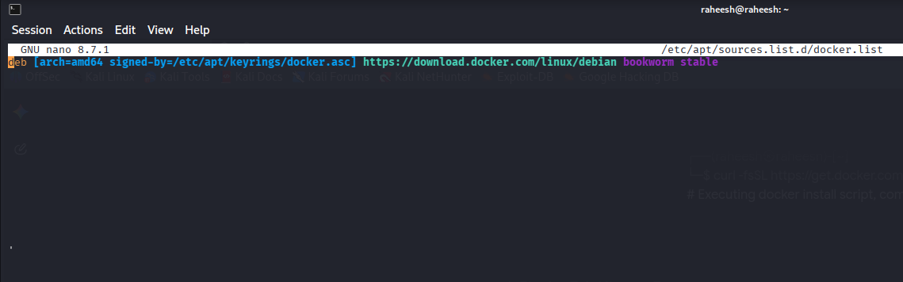
*Figure 1.1 — Adding the Docker GPG-signed repository entry in `/etc/apt/sources.list.d/docker.list`.*

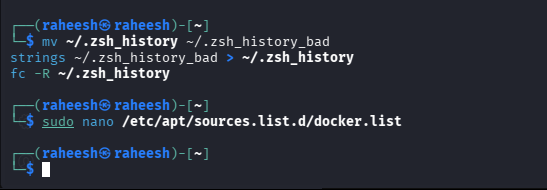
*Figure 1.2 — Terminal session showing the repository file being edited before installation.*

**Install Docker packages:**

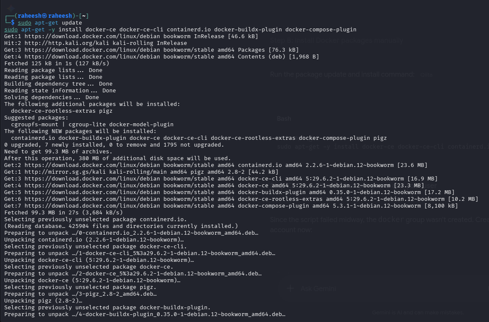
*Figure 1.3 — Running `sudo apt-get -y install docker-ce docker-ce-cli containerd.io docker-buildx-plugin docker-compose-plugin`, pulling and unpacking all required packages.*

**Verify the installation:**

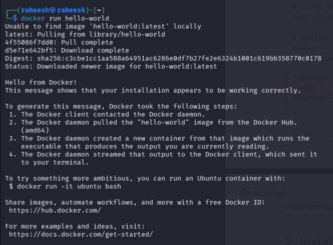
*Figure 1.4 — `docker run hello-world` confirms Docker is installed and working correctly.*

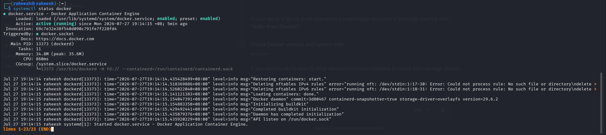
*Figure 1.5 — `systemctl status docker` shows the Docker daemon active and running.*

---

## 2. Install AWS CLI v2

AWS CLI v2 was installed on Linux via the official installer bundle (not the distro package), as recommended in the cheatsheet.

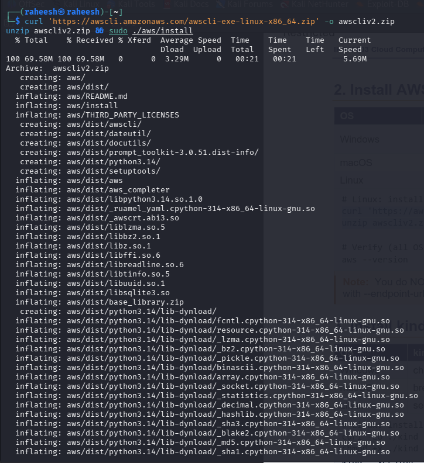
*Figure 2.1 — Downloading, unzipping, and installing the AWS CLI v2 bundle with `curl` and `./aws/install`.*

Version verification is included in the combined checklist screenshot (Figure 7.1).

---

## 3. Install kind & kubectl

`kind` (Kubernetes-in-Docker) was installed via direct binary download, and `kubectl` was installed via `apt`.

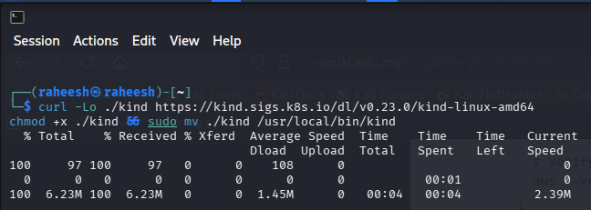
*Figure 3.1 — Downloading the `kind` binary and moving it to `/usr/local/bin/kind`.*

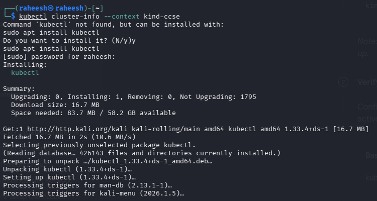
*Figure 3.2 — Initial `kubectl cluster-info` attempt failed because `kubectl` was not yet installed; `sudo apt install kubectl` resolved this.*

---

## 4. Helper Tools (OpenSSL, oathtool)

OpenSSL was already available on Kali; `oathtool` was installed via `apt`.

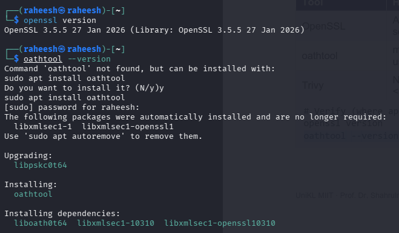
*Figure 4.1 — `openssl version` confirms OpenSSL 3.5.5, and `oathtool --version` triggers installation before confirming the version.*

---

## 5. Start & Stop the Lab Environment

### LocalStack (the local AWS)

The first LocalStack start used the `:3.8.0` image tag, which turned out to require a Pro license and failed to start.

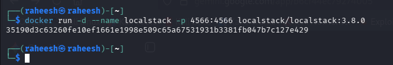
*Figure 5.1 — First `docker run -d --name localstack -p 4566:4566 localstack/localstack:3.8.0` pulling the image.*

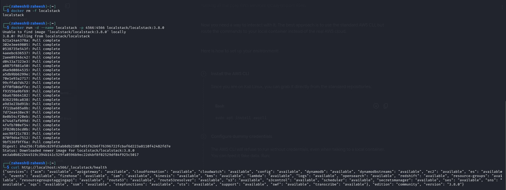
*Figure 5.2 — Removing the container and re-pulling the `:3.8.0` image after the port was freed.*

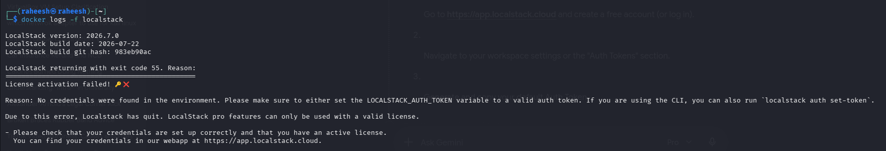
*Figure 5.3 — `docker logs -f localstack` reveals a "License activation failed" error, since `:3.8.0` resolved to the Pro edition without a valid auth token.*

**Fix:** the container was removed and re-created using the default `localstack/localstack` (community) image instead of the pinned Pro tag.

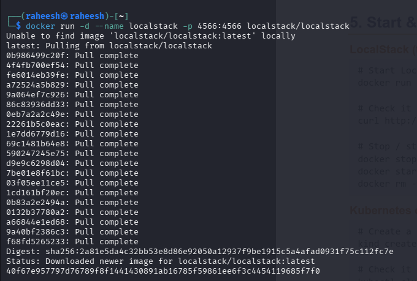
*Figure 5.4 — Re-pulling `localstack/localstack:latest`, which resolves to the free Community edition.*

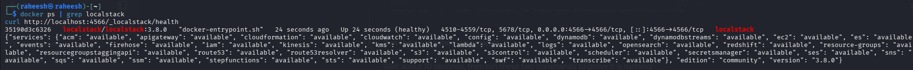
*Figure 5.5 — `docker ps | grep localstack` shows the container healthy, and `curl http://localhost:4566/_localstack/health` returns all AWS services as available.*

### Kubernetes cluster (kind)

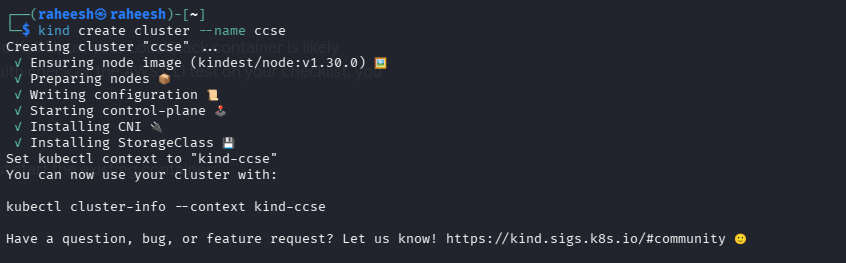
*Figure 5.6 — `kind create cluster --name ccse` successfully provisions the control-plane node, CNI, and StorageClass.*

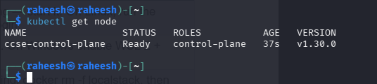
*Figure 5.7 — `kubectl get node` confirms the `ccse-control-plane` node is `Ready`.*

---

## 6. One-Time AWS CLI Configuration

Dummy credentials were configured so the AWS CLI would stop prompting, since LocalStack accepts any credentials.

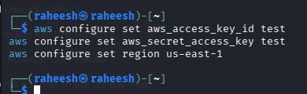
*Figure 6.1 — Setting dummy `aws_access_key_id`, `aws_secret_access_key`, and `region` values with `aws configure set`.*

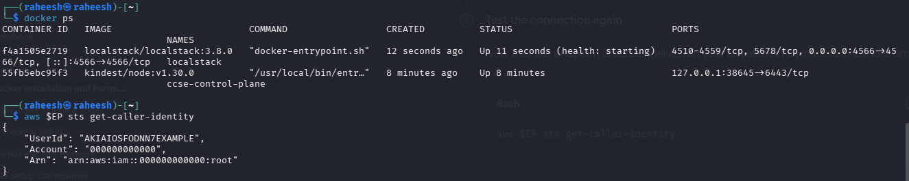
*Figure 6.2 — `docker ps` shows both the `localstack` and `ccse-control-plane` containers running, and `aws $EP sts get-caller-identity` returns a valid dummy identity, confirming the CLI is correctly talking to LocalStack.*

---

## 7. Pre-Lab Verification Checklist

All items from the cheatsheet's verification checklist were confirmed working:

- [x] `docker --version` prints a version, and `docker run hello-world` works
- [x] `aws --version` prints `aws-cli/2.x`
- [x] `kind --version` and `kubectl version --client` both work
- [x] LocalStack starts and `curl .../health` responds
- [x] `aws $EP sts get-caller-identity` returns an identity
- [x] `kind create cluster` works and `kubectl get nodes` shows a node

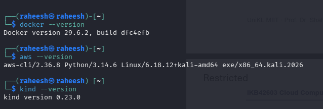
*Figure 7.1 — Combined verification: `docker --version`, `aws --version`, and `kind --version` all print valid versions.*

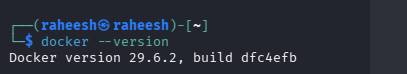
*Figure 7.2 — `docker --version` confirmed independently.*

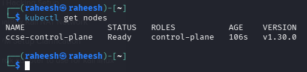
*Figure 7.3 — `kubectl get nodes` shows the `ccse-control-plane` node `Ready`.*

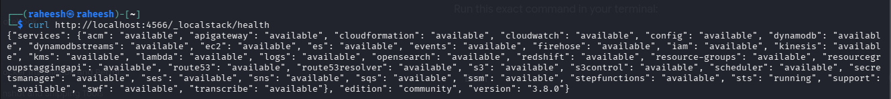
*Figure 7.4 — Final `curl http://localhost:4566/_localstack/health` check, confirming all AWS services (including `sts`) are available.*

---

## Summary

All tools required for IKB42603 labs — Docker, AWS CLI v2, kind, kubectl, OpenSSL, and oathtool — were successfully installed and verified on Kali Linux. The only issue encountered was LocalStack failing to start under the `:3.8.0` image tag due to a Pro license requirement; this was resolved by switching to the default Community edition image. The local Kubernetes cluster (`kind-ccse`) and LocalStack container were both confirmed healthy and ready for use in subsequent labs.
