# IKB42603 Cloud Computing Security Essentials
## Lab 1: Cloud Account Security, Identity & Access Management

**Name:** Raheesh
**Programme:** Bachelor of Information Technology (Hons) in Computer System Security (BCSS)
**Institution:** Universiti Kuala Lumpur, Malaysian Institute of Information Technology (UniKL MIIT)
**Date:** 2 August 2026

---

## Session A (Week 1) — Cloud Identity with LocalStack

### One-Time Environment Setup

**Step 1 — Confirm Docker is installed and running**

```
docker --version
```

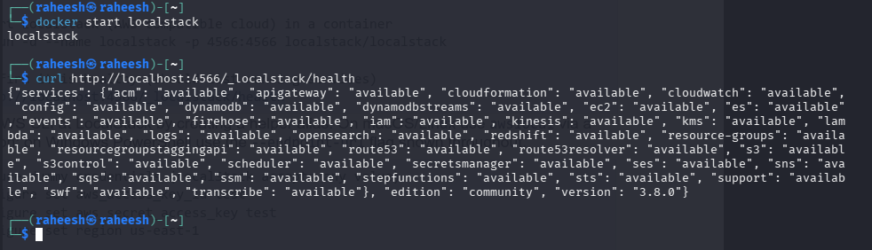

**Step 2 — Start LocalStack (AWS-compatible cloud) in a container**

```
docker run -d --name localstack -p 4566:4566 localstack/localstack
```

The image was pulled successfully, but the container name `localstack` was already in use from a previous attempt, so the run command returned a naming conflict.

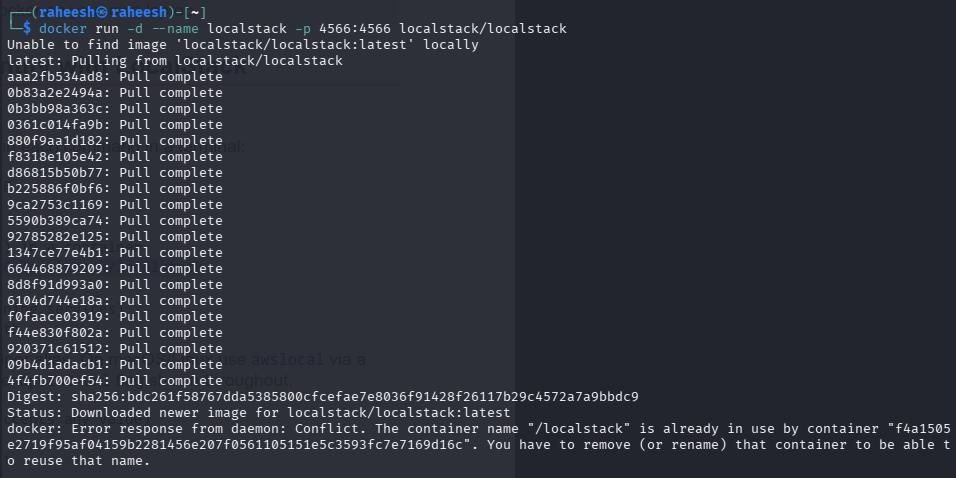

The existing container was started instead, and its health was confirmed:

```
docker start localstack
curl http://localhost:4566/_localstack/health
```

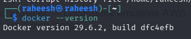

The health endpoint returned `"available"` for all core services (IAM, STS, S3, EC2, etc.), confirming LocalStack was ready to accept requests.

**Step 3 — Point the AWS CLI at LocalStack**

```
aws configure set aws_access_key_id test
aws configure set aws_secret_access_key test
aws configure set region us-east-1
aws --endpoint-url=http://localhost:4566 sts get-caller-identity
```

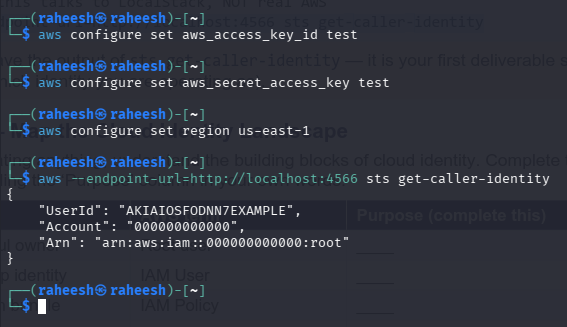

The output confirms the CLI is talking to LocalStack (not real AWS), operating as the root user (`arn:aws:iam::000000000000:root`).

---

### Task 1 — Map the Cloud Identity Landscape

| Concept | AWS term | Purpose |
|---|---|---|
| All-powerful owner | Root user | *(to complete)* |
| Human/app identity | IAM User | *(to complete)* |
| Permission bundle | IAM Policy | *(to complete)* |
| Collection of users | IAM Group | *(to complete)* |
| Temporary identity | IAM Role | *(to complete)* |

---

### Task 2 — Create a Least-Privilege Admin (Stop Using Root)

**Step 2.1 — Create a group and attach an admin policy to the group**

```
EP='--endpoint-url=http://localhost:4566'
aws $EP iam create-group --group-name Admins
aws $EP iam attach-group-policy --group-name Admins \
--policy-arn arn:aws:iam::aws:policy/AdministratorAccess
```

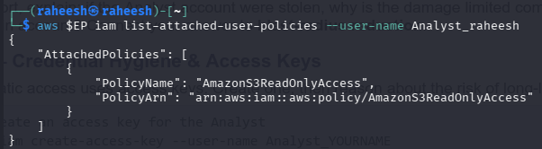

**Step 2.2 — Create the personal admin user**

```
aws $EP iam create-user --user-name CloudAdmin_raheesh
```

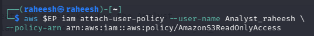

**Step 2.3 — Put the user in the group**

```
aws $EP iam add-user-to-group --group-name Admins \
--user-name CloudAdmin_raheesh
```

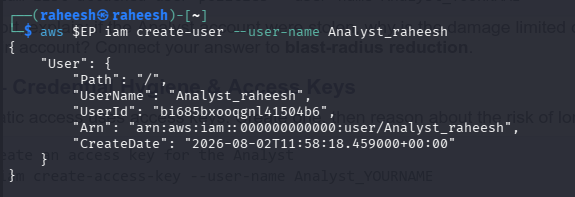

**Step 2.4 — Verify the membership**

```
aws $EP iam get-group --group-name Admins
```

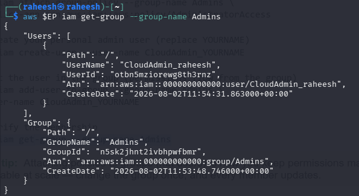

The output confirms `CloudAdmin_raheesh` is listed under the `Admins` group, which has `AdministratorAccess` attached — permissions flow from the group rather than being attached directly to the user.

---

### Task 3 — Enforce Least Privilege with a Scoped Policy

**Step 3.1 — Create a read-only user**

```
aws $EP iam create-user --user-name Analyst_raheesh
```

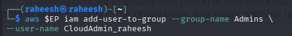

**Step 3.2 — Attach a scoped, read-only policy (S3 read only)**

```
aws $EP iam attach-user-policy --user-name Analyst_raheesh \
--policy-arn arn:aws:iam::aws:policy/AmazonS3ReadOnlyAccess
```

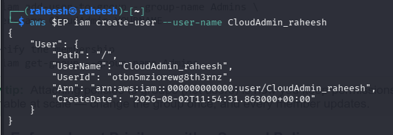

**Step 3.3 — List what the user can do**

```
aws $EP iam list-attached-user-policies --user-name Analyst_raheesh
```

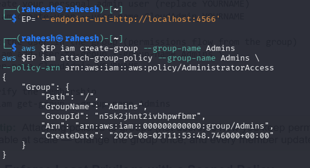

The output confirms `Analyst_raheesh` has only `AmazonS3ReadOnlyAccess` attached — no write or administrative permissions.

**Reflection — blast-radius reduction:**
*(to complete: if the Analyst account were stolen, why is the damage limited compared to a stolen admin account?)*

---

### Task 4 — Credential Hygiene & Access Keys

**Step 4.1 — Create an access key for the Analyst**

```
aws $EP iam create-access-key --user-name Analyst_raheesh
```

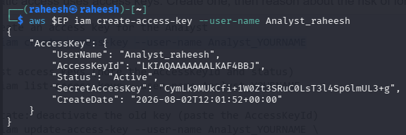

**Step 4.2 — List access keys**

```
aws $EP iam list-access-keys --user-name Analyst_raheesh
```

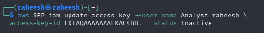

The `AccessKeyId` (`LKIAQAAAAAAALKAF4BBJ`) and `Status: Active` were noted for the rotation step.

**Step 4.3 — Rotate: deactivate the old key**

```
aws $EP iam update-access-key --user-name Analyst_raheesh \
--access-key-id LKIAQAAAAAAALKAF4BBJ --status Inactive
```

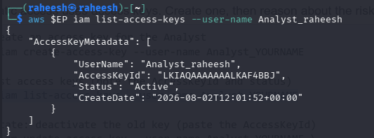

---

## Session B (Week 2) — Enforced Access Control with Kubernetes RBAC

### Setup — Create a Local Kubernetes Cluster

```
kind create cluster --name ccse-lab1
```

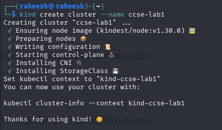

```
kubectl cluster-info --context kind-ccse-lab1
kubectl get nodes
```

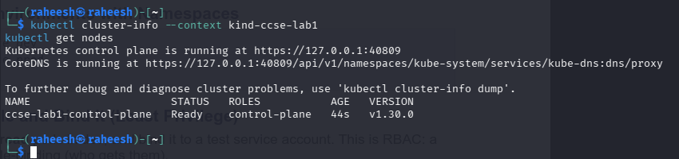

The control plane is running and the single node `ccse-lab1-control-plane` is `Ready`.

### Task 5 — Separate Environments with Namespaces

```
kubectl create namespace dev
kubectl create namespace prod
kubectl get namespaces
```

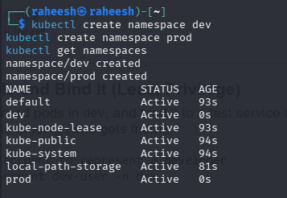

### Task 6 — Define a Role and Bind It (Least Privilege)

```
kubectl create serviceaccount dev-user -n dev
kubectl create role pod-reader -n dev \
--verb=get,list,watch --resource=pods
kubectl create rolebinding dev-user-binding -n dev \
--role=pod-reader --serviceaccount=dev:dev-user
```

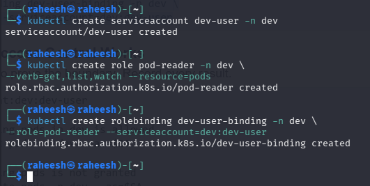

### Task 7 — Test That Access Control Works

```
SA=system:serviceaccount:dev:dev-user

kubectl auth can-i list pods -n dev --as=$SA
kubectl auth can-i delete pods -n dev --as=$SA
kubectl auth can-i list pods -n prod --as=$SA
```

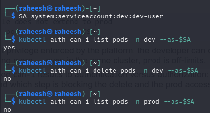

| Check | Result |
|---|---|
| `list pods` in `dev` | **yes** |
| `delete pods` in `dev` | **no** |
| `list pods` in `prod` | **no** |

---

## Deliverables & Assessment

### 1. Screenshots
- [x] Output of `sts get-caller-identity`
- [x] `get-group Admins` output showing `CloudAdmin_raheesh` as a member
- [x] `list-attached-user-policies` for the Analyst showing only the read-only policy
- [x] The three `kubectl auth can-i` results (YES / NO / NO)

### 2. Short-Answer Questions

**Q1. Why is attaching policies to groups better than attaching them directly to users?**

Attaching a policy to a group centralises permission management: the policy is defined once on the group, and every member inherits it automatically. When permissions need to change, only the group's policy is updated instead of editing every individual user's attachments one by one. This also makes access easier to audit — checking who has admin rights just means listing the group's members — and it reduces the chance of a user being left with an inconsistent or forgotten permission set as the team grows.

**Q2. What is the difference between an IAM User and an IAM Role?**

An IAM User is a persistent identity with its own long-term credentials (password and/or access keys) that represents a specific person or application. An IAM Role has no credentials of its own — it is assumed temporarily by a trusted user, application, or service, which receives short-lived, auto-expiring security tokens for the duration of the session. Users are for permanent identities; Roles are for temporary, delegated access.

**Q3. Explain least privilege using the Analyst account, and how it reduces blast radius if compromised.**

The `Analyst_raheesh` account was granted only `AmazonS3ReadOnlyAccess`, meaning it can view S3 data but cannot modify, delete, or provision any other AWS resource. If its credentials were stolen, an attacker could only read S3 objects — they could not create resources, exfiltrate data by other means, delete infrastructure, or pivot into other services like IAM or EC2. Compare this to the `CloudAdmin_raheesh` account, which has `AdministratorAccess`: a compromise there would let an attacker do virtually anything in the account. Scoping the Analyst to the minimum permissions it needs shrinks the "blast radius" — the scope of damage a single compromised credential can cause — down to one read-only service.

**Q4. In Kubernetes, what is the difference between a Role and a RoleBinding?**

A Role defines a set of permissions (which verbs — get, list, watch, delete, etc. — are allowed on which resources) within a namespace, but on its own it doesn't grant anything to anyone. A RoleBinding is what actually grants those permissions by linking a Role to specific subjects (users, groups, or service accounts). In this lab, the `pod-reader` Role described "what is allowed," and the `dev-user-binding` RoleBinding decided "who gets it" — namely the `dev-user` service account.

**Q5. Why did the developer service account fail to access prod, and which security principle does that demonstrate?**

The `dev-user` service account failed to list pods in `prod` because its RoleBinding (`dev-user-binding`) only exists in the `dev` namespace and only binds to the `pod-reader` Role, which itself is scoped to `dev`. Since a namespaced Role's permissions don't extend beyond the namespace it was created in, there is no rule granting `dev-user` any access in `prod` — and Kubernetes RBAC defaults to deny for anything not explicitly allowed. This demonstrates the principle of least privilege enforced through explicit, scoped authorization: an identity can act only within the boundaries it was deliberately granted, nothing more.

### 3. Verification Command
```
kubectl get rolebinding dev-user-binding -n dev -o yaml
```

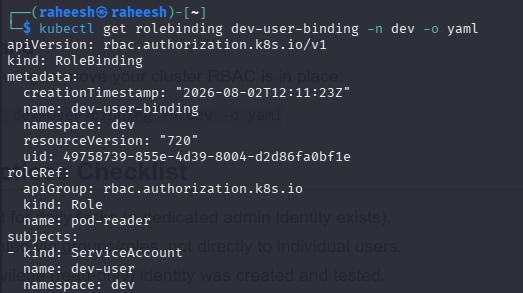

The output confirms `dev-user-binding` in the `dev` namespace references the `pod-reader` Role and binds it to the `ServiceAccount` `dev-user` in namespace `dev`, matching the RBAC configuration created in Task 6.

---

## Security Best-Practices Checklist

- [x] Root user is not used for daily tasks (a dedicated admin identity exists)
- [x] Permissions are granted via groups/roles, not directly to individual users
- [x] At least one least-privilege (read-only) identity was created and tested
- [x] Access keys were listed and a rotation (deactivate) was demonstrated
- [x] Kubernetes RBAC blocks an unauthorised action (delete / cross-namespace)
