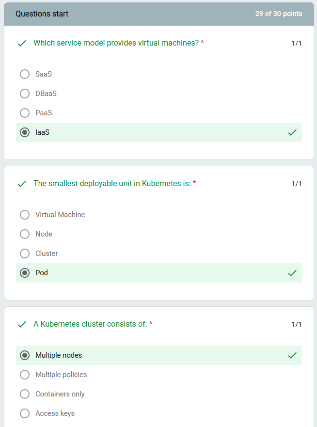
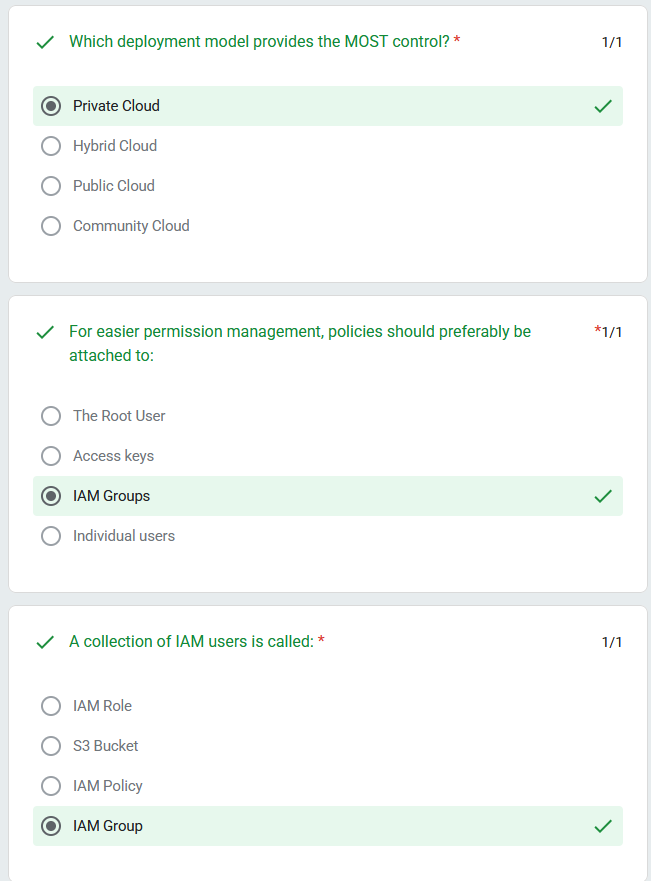
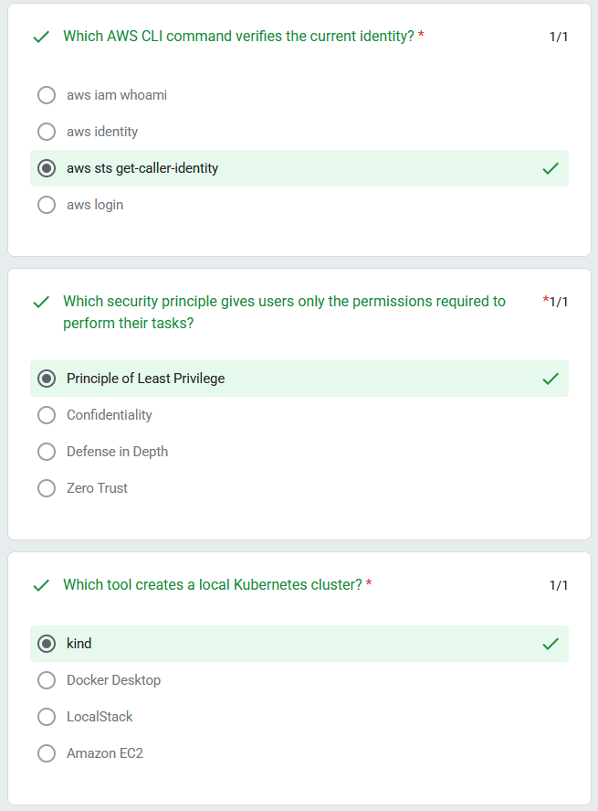
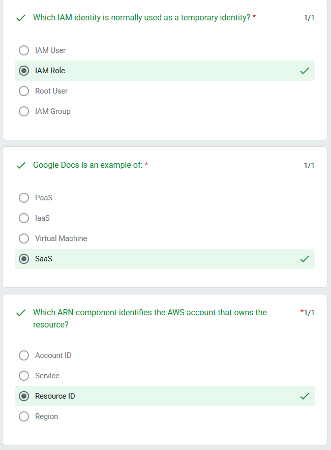
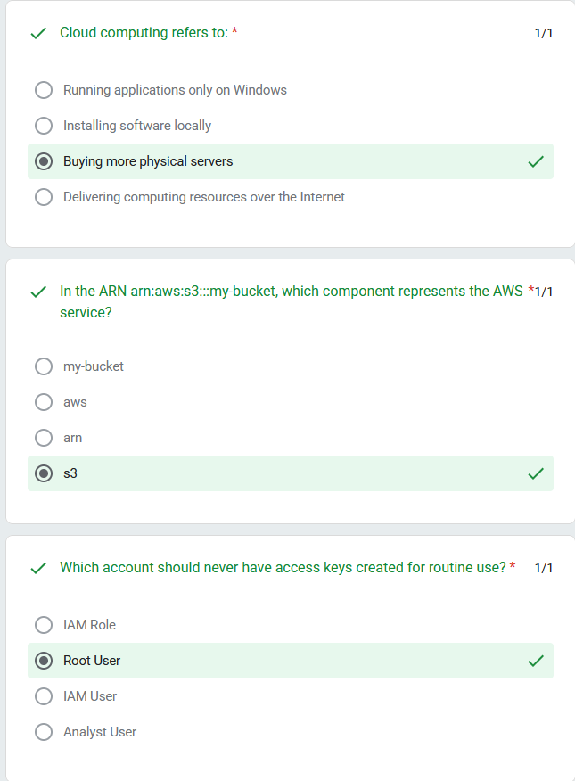
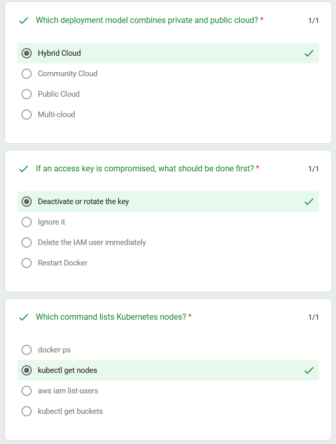
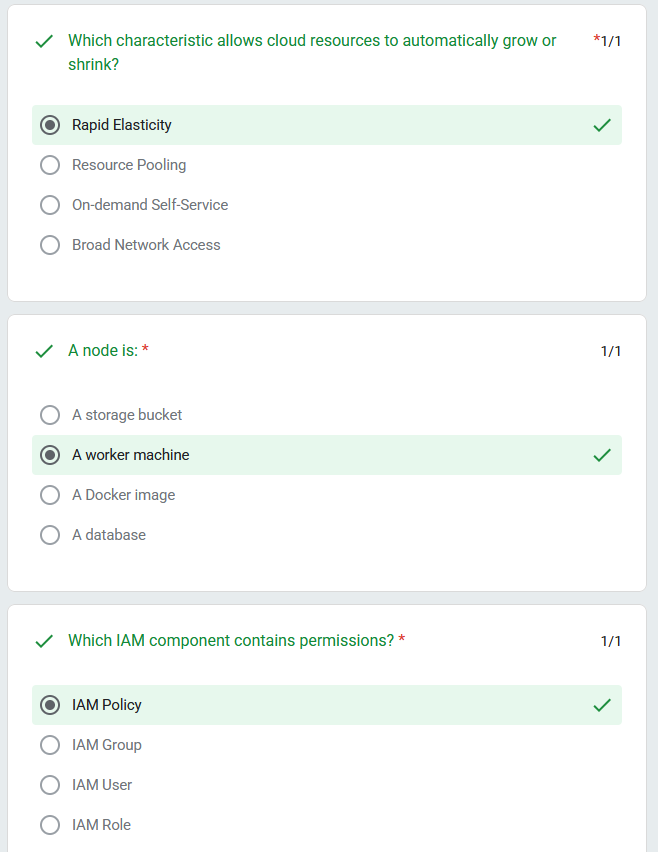
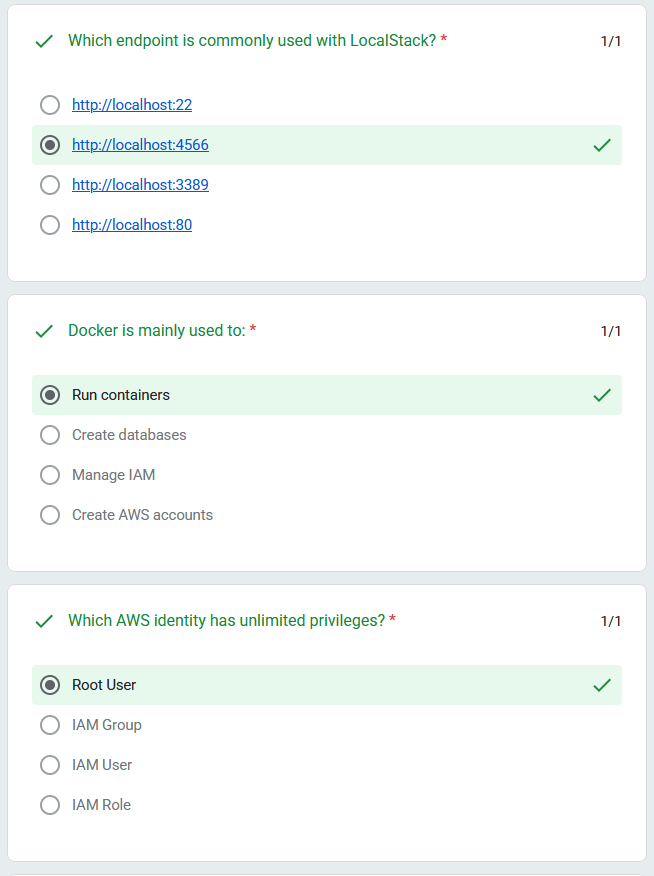
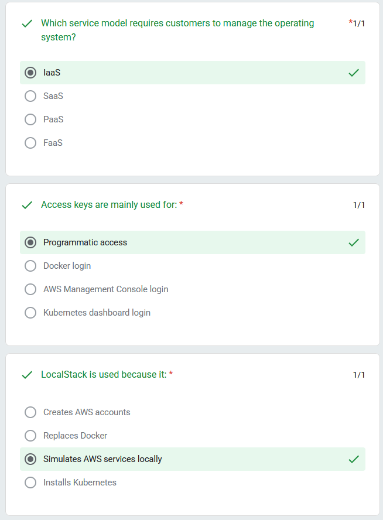
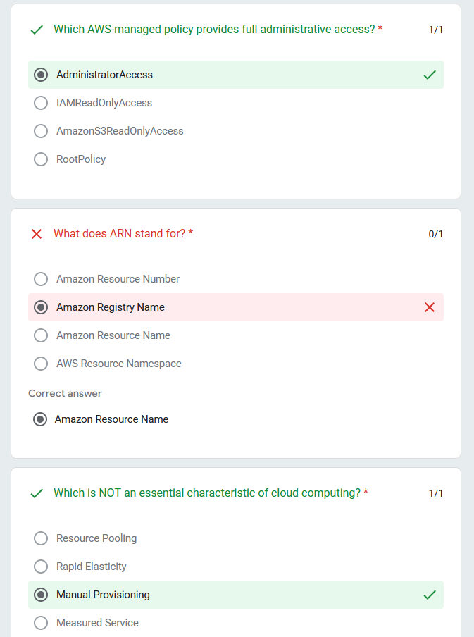

# Cloud Computing Security Essentials — Quiz Report

**Name:** Raheesh
**Programme:** Bachelor of Information Technology (Hons) in Computer System Security (BCSS)
**Institution:** Universiti Kuala Lumpur, Malaysian Institute of Information Technology (UniKL MIIT)
**Course:** IKB42603 Cloud Computing Security Essentials
**Date:** 3 August 2026

---

## Quiz Result

**Score: 29 / 30 points**

The quiz covered core concepts from the course, including cloud computing essential characteristics, deployment and service models, AWS IAM, ARNs, LocalStack, Docker, and Kubernetes fundamentals.

---

## Question Breakdown

### Score Summary

### Service Models, Kubernetes Pods, and Clusters

### Deployment Models and IAM Groups

### IAM Roles, SaaS, and ARN Components

### AWS CLI, Least Privilege, and Kubernetes Tools

### Cloud Computing Definition, ARN Structure, and Root User

### Deployment Models, Access Key Compromise, and kubectl

### Cloud Elasticity, Kubernetes Nodes, and IAM Policies

### LocalStack Endpoint, Docker, and Root User Privileges

### AWS Managed Policies, ARN Definition, and Cloud Characteristics

---

## Reflection

The only question missed was **"What does ARN stand for?"**, where "Amazon Registry Name" was selected instead of the correct answer, **Amazon Resource Name**. All other questions — covering IAM fundamentals (users, roles, groups, policies, access keys), the essential characteristics of cloud computing, service and deployment models (IaaS/PaaS/SaaS, public/private/hybrid), LocalStack, Docker, and Kubernetes (nodes, pods, clusters, kubectl commands) — were answered correctly.
